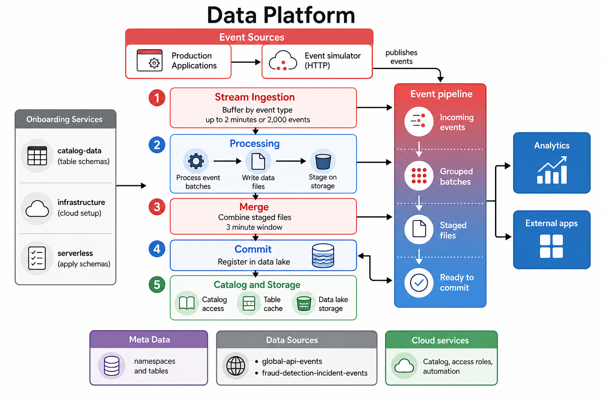

# Data Platform Service

A multi-module Maven application that ingests product data events from Kafka, buffers and groups them, and lands them in an analytics-ready lakehouse format on AWS.



### Storage and catalog

**Apache Iceberg** is the open table format used for all event data. Iceberg manages table metadata (schema, partitions, file manifests) as a layer on top of object storage. The events-processor appends grouped events as Parquet files and commits Iceberg metadata atomically, so query engines always see a consistent snapshot of the table. Tables are partitioned by `event_time` (day or hour, as defined in the catalog schema).

**AWS Glue** is the central catalog service. It registers Iceberg namespaces and tables so that engines such as Athena and Spark can discover schemas, S3 locations, and partitions without scanning raw files. When a product team onboards a new event type, the platform creates or updates the corresponding Glue/Iceberg table from the schema defined in `catalog-data`.

**Amazon S3** is the durable storage layer. Parquet data files are written under each table's bucket location (for example, `s3://{bucketName}/data/`), and Iceberg metadata files live in the same bucket. S3 provides high durability, virtually unlimited scale, and pay-as-you-go storage that fits event workloads with varying retention needs.

#### Why Iceberg?

| Advantage | Description |
|-----------|-------------|
| **Schema evolution** | Add, rename, or drop columns without rewriting existing data. The `apply-catalog-schema` Lambda merges new fields from `catalog-data` into live Glue tables. |
| **Hidden partitioning** | Partition specs are stored in table metadata; queries filter on `event_time` without callers needing to know the physical folder layout. |
| **ACID commits** | Appends are committed atomically via Iceberg snapshots, so readers never see partial or corrupt batches. |
| **Time travel & snapshots** | Historical table states are retained in metadata, enabling audit queries and rollback without duplicating data files. |
| **Format-agnostic reads** | The same table can be queried by Athena, Spark, Trino, and other engines through the Glue catalog. |
| **Efficient small-file handling** | Metadata tracks every data file, enabling compaction and pruning strategies as tables grow. |
| **Open standard** | Iceberg is engine-neutral and avoids vendor lock-in compared to proprietary table formats. |

#### One S3 bucket per event type

Each product team event type is stored in its **own dedicated S3 bucket**, configured via the `bucketName` field in the catalog schema. This one-bucket-per-table model provides:

1. **Separation from other tables** — Data for each event type is isolated in its own bucket, avoiding cross-table access patterns and simplifying ownership boundaries between product teams.
2. **Independent lifecycle policies** — Retention, transition to S3 Infrequent Access or Glacier, and expiration rules can be set per bucket to match each event type's compliance or cost requirements.
3. **Regional replication for compliance and backup** — Buckets can be replicated to another AWS region independently via S3 Cross-Region Replication (CRR), supporting disaster recovery and data-residency rules without affecting other event types.
4. **Easy data discard** — When a table is decommissioned, emptying or deleting a single bucket removes all associated data without touching other teams' events.
5. **Granular IAM and access control** — Bucket policies and IAM roles can grant read or write access per event type, so teams only reach the data they own.
6. **Independent cost tracking** — S3 storage, request, and transfer costs are attributed to a single bucket per table, making chargeback and budget monitoring straightforward.
7. **Per-bucket encryption** — SSE-S3, SSE-KMS, or bucket-specific KMS keys can be applied where a team requires stronger encryption or key rotation.
8. **Isolated operational changes** — Versioning, logging, inventory, and event notifications can be enabled or tuned per bucket without impacting other tables.
9. **Safer schema or pipeline migrations** — New buckets can be provisioned for a redesigned event type while the old bucket is drained on its own schedule.
10. **Compliance-friendly boundaries** — Sensitive event types (for example, fraud or PII-heavy streams) can live in buckets with stricter policies, replication, and audit settings than general-purpose events.

The **infrastructure** Terraform module reads `bucketName` values from `catalog-data` and provisions these buckets automatically when a new event type is onboarded.

## Architecture overview

The ingestion pipeline uses **two Kafka Streams topologies** plus two Micronaut Kafka consumers. Staged Parquet files are **pre-commit merged** before they are registered in Iceberg, which reduces small-file overhead in Athena and survives task restarts via durable Kafka staging.

1. **events-producer** (or external producers) publish JSON events to the `dp-raw-events` Kafka topic.
2. **Topology 1 — event grouping** (`ProcessRawDataStreamTopology`) buffers events by `namespace|type` and publishes grouped batches to `dp-raw-grouped-events` when either **2 minutes** elapse or **2,000 records** accumulate (whichever comes first).
3. **IngestRawDataConsumer** converts each grouped batch to Iceberg records, writes a **staged Parquet file** to S3 via `prepare()`, and publishes a `StoredRawData` message to `dp-catalog-written-events` (message key: `namespace|type`). Files are **not yet visible in Athena** at this stage.
4. **Topology 2 — pre-commit merge** (`ProcessCatalogWrittenStreamTopology`) accumulates `StoredRawData` references per `namespace|type` in a Kafka Streams state store. Every **3 minutes**, it calls `mergeStagedFiles()` to coalesce staged Parquet files into one file, deletes the small staging files from S3, and forwards the merged result to `dp-commit-raw-data-events`.
5. **CommitRawDataConsumer** receives the merged `StoredRawData` and commits the file to the Iceberg table via the Glue catalog (`writeData()`). Data becomes **queryable in Athena** after this commit.
6. **catalog-data** JSON schemas define namespaces, tables, S3 buckets, and event fields. The **serverless** Lambda applies those schemas to Glue; **infrastructure** Terraform provisions the backing S3 buckets and IAM roles.

### Ingest pipeline diagram

```
dp-data-events
    │  Topology 1: buffer (2 min / 2000 events)
    ▼
dp-store-data-events
    │  IngestRawDataConsumer.prepare() → staged Parquet on S3
    ▼
dp-merge-data-events
    │  Topology 2: pre-commit merge window (3 min)
    ▼
dp-commit-data-events
    │  CommitRawDataConsumer.writeData() → Iceberg commit
    ▼
Athena / Glue (queryable)
```

### Data freshness (5-minute SLA target)

| Stage | Default max wait | Config |
|-------|------------------|--------|
| Event grouping (Topology 1) | 2 minutes | `MAX_BUFFER_TIME` (default `PT2M`) |
| Pre-commit merge (Topology 2) | 3 minutes | `PRE_COMMIT_MERGE_WINDOW` (default `PT3M`) |
| Parquet merge + Iceberg commit | ~30–60 seconds | — |

Typical end-to-end latency from event ingest to Athena queryability is **~5 minutes** under normal load. Use `namespace|type` as the Kafka key on `dp-catalog-written-events` so all staging for an event type is merged in one window per partition.

### Pre-commit merge vs Iceberg compaction

| | Pre-commit merge (this pipeline) | Iceberg compaction (future/async) |
|--|----------------------------------|-----------------------------------|
| **When** | After Parquet write, **before** Iceberg commit | After files are already in a snapshot |
| **Purpose** | Fewer, larger files at ingest time | Rewrite already-committed small files |
| **Athena visibility** | Small staged files are never committed | Small files visible until compaction runs |

## Maven modules

| Module               | Description |
|----------------------|-------------|
| **events-simulator** | Micronaut HTTP service for local and test use. Exposes `/events/generate` to publish sample events to the `dp-raw-events` Kafka topic. |
| **events-processor** | Core ingestion service. Runs two Kafka Streams topologies (event grouping and pre-commit merge), stages Parquet on S3, merges staged files before catalog commit, and registers data in Iceberg through AWS Glue. |
| **serverless**       | AWS Lambda functions and Terraform for deploying catalog-management workloads. The `apply-catalog-schema` Lambda reads schema files from `catalog-data` and creates or updates Glue/Iceberg tables. |
| **infrastructure**   | Terraform for shared AWS resources: S3 data buckets (derived from `catalog-data`), Glue catalog IAM roles, and Athena query workgroups. |

## Catalog data — onboarding product events

Product teams onboard new event types by adding a JSON schema under `catalog-data/`. Each event type maps to one Iceberg table.

### Directory layout

```
catalog-data/
└── {namespace}/
    └── {tableName}.json
```

Examples in this repository:

- `catalog-data/global/api_events.json`
- `catalog-data/fraud_detection/incident_events.json`

### Schema file format

```json
{
  "namespace": "global",
  "tableName": "api_events",
  "bucketName": "global-api-events",
  "partitionType": "DAY",
  "fields": [
    {
      "id": 10,
      "name": "user_id",
      "dataType": "STRING",
      "deprecated": false
    }
  ]
}
```

| Field | Description |
|-------|-------------|
| `namespace` | Logical grouping for the event (also used as the Glue/Iceberg namespace). |
| `tableName` | Event type name. Must match the `type` field in published Kafka events. |
| `bucketName` | S3 bucket where Parquet data is stored. Provisioned by the **infrastructure** Terraform module. |
| `partitionType` | `DAY` or `HOUR` — partitions the table on `event_time`. |
| `fields` | Custom event attributes. Supported `dataType` values: `STRING`, `INT`, `LONG`, `TIMESTAMP`, `DATE`. |

The platform automatically adds these columns to every table: `event_id`, `tenant_id`, `load_time`, and `event_time`. Product schemas should only define business-specific fields.

### Onboarding steps

1. **Add the schema file** — Create `catalog-data/{namespace}/{tableName}.json` following the format above. Use unique field `id` values (10 and above).
2. **Provision infrastructure** — Apply the **infrastructure** Terraform module. S3 buckets are created automatically from `bucketName` values in the catalog JSON files.
3. **Apply the Glue schema** — Build and deploy the **serverless** module, then invoke the `apply-catalog-schema-{env}` Lambda with:

   ```json
   {
     "namespace": "global",
     "tableName": "api_events"
   }
   ```

   The Lambda creates the Glue namespace and Iceberg table (or adds new columns if the table already exists).
4. **Publish events** — Send events to Kafka with matching `namespace` and `type` values (see [Simulating events](#simulating-events) below).

## Running events-processor

### Prerequisites

- Java 21
- Maven
- A running Kafka cluster with topics: `dp-raw-events`, `dp-raw-grouped-events`, `dp-catalog-written-events`, and `dp-commit-raw-data-events` (auto-create is disabled; create these before starting the processor)
- AWS credentials with permission to assume the Glue catalog role
- Catalog schema files available locally (see `CATALOG_DATA_DIR`)

### Local development (dev profile)

The `application-dev.yml` profile provides local defaults for Kafka and catalog paths:

```bash
mvn -pl events-processor mn:run -Dmicronaut.environments=dev
```

Review and adjust paths in `events-processor/src/main/resources/application-dev.yml` before running.

### Production / custom configuration

Run with environment variables that map to `application.yml`:

```bash
export KAFKA_BROKERS="broker1:9092,broker2:9092"
export STREAM_APP_NAME="dp-data-process-app"
export STREAM_STATE_DIR="/var/lib/kafka-streams/state"
export MAX_POLL_RECORDS="500"
export CATALOG_DATA_DIR="/path/to/catalog-data"
export GLUE_ASSUME_ROLE_ARN="arn:aws:iam::ACCOUNT:role/dp-glue-catalog-role-dev"
export GLUE_AWS_REGION="ap-southeast-2"

mvn -pl events-processor mn:run
```

Standard AWS credentials must be available to the SDK (for example via ECS task role, or locally via `AWS_PROFILE` / `aws sso login`). When using `AssumeRoleAwsClientFactory`, the base credentials are used only to assume `GLUE_ASSUME_ROLE_ARN`.

```bash
# Optional tuning for ingest latency and file sizes
export MAX_BUFFER_TIME="PT2M"
export MAX_BUFFER_RECORDS="2000"
export PRE_COMMIT_MERGE_WINDOW="PT3M"
```

### Required environment variables

| Variable | Description |
|----------|-------------|
| `KAFKA_BROKERS` | Comma-separated Kafka bootstrap servers. |
| `STREAM_APP_NAME` | Kafka Streams `application.id` (must be unique per deployment). |
| `STREAM_STATE_DIR` | Local directory for Kafka Streams state stores. |
| `MAX_POLL_RECORDS` | Maximum records per poll for the stream consumer. |
| `CATALOG_DATA_DIR` | Absolute path to the `catalog-data` directory. |
| `GLUE_ASSUME_ROLE_ARN` | IAM role ARN assumed to access Glue and S3. |
| `GLUE_AWS_REGION` | AWS region for Glue and S3 clients. |

### Optional environment variables

| Variable | Default | Description |
|----------|---------|-------------|
| `MAX_BUFFER_RECORDS` | `2000` | Maximum events buffered per `namespace|type` key before flushing a group (Topology 1). |
| `MAX_BUFFER_TIME` | `PT2M` | Maximum time to hold events in the grouping buffer before flushing (Topology 1). |
| `PRE_COMMIT_MERGE_WINDOW` | `PT3M` | Wall-clock interval for pre-commit merge of staged Parquet files (Topology 2). |

The service listens on port **8082** by default.

### Kafka topics

| Topic                       | Producer                    | Consumer | Payload |
|-----------------------------|-----------------------------|----------|---------|
| `dp-data-events`            | events-simulator / external | Topology 1 | Single `RawDataEvent` |
| `dp-raw-grouped-events`     | Topology 1                  | IngestRawDataConsumer | `List<RawDataEvent>` |
| `dp-catalog-written-events` | IngestRawDataConsumer       | Topology 2 | `StoredRawData` (staged Parquet metadata) |
| `dp-commit-raw-data-events` | Topology 2                  | CommitRawDataConsumer | `StoredRawData` (merged, ready to commit) |

Create all topics before starting the processor:

```bash
for topic in dp-raw-events dp-raw-grouped-events dp-catalog-written-events dp-commit-raw-data-events; do
  kafka-topics.sh --create --topic "$topic" \
    --bootstrap-server localhost:9092 \
    --partitions 3 --replication-factor 1
done
```

Create topics

```
kafka-topics.sh --create --topic dp-data-events --bootstrap-server localhost:9092 --partitions 3 --replication-factor 1
```
```
kafka-topics.sh --create --topic dp-store-data-events --bootstrap-server localhost:9092 --partitions 3 --replication-factor 1
```
```
kafka-topics.sh --create --topic dp-merge-data-events --bootstrap-server localhost:9092 --partitions 3 --replication-factor 1
```
```
kafka-topics.sh --create --topic dp-commit-data-events --bootstrap-server localhost:9092 --partitions 3 --replication-factor 1
```


Use enough partitions on `dp-catalog-written-events` for your active event types. Message keys should be `namespace|type` (for example `global|api_events`).

## Infrastructure deployment steps 

### Prerequisites<br/>
Set AWS credential by environment variables.

```export AWS_ACCESS_KEY_ID```
```export AWS_SECRET_ACCESS_KEY```
```export AWS_SESSION_TOKEN```

``terraform init -backend-config 'region=ap-southeast-2' -backend-config 'bucket=tfstate-resources-128779316957-ap-southeast-2-an' -lock=true``

### Setup & select workspace
```terraform workspace select -or-create dev```

### Plan resources
```terraform plan -var-file tfvars/dev.tfvars -out deployment.tfplan```

### Apply resources
```terraform apply deployment.tfplan```


## Simulating events

### Using events-simulator

The **events-simulator** module is a lightweight Micronaut app that publishes sample `api_events` to Kafka.

1. Start Kafka locally (ensure `dp-data-events` topic exists).
2. Run the producer:

   ```bash
   mvn -pl events-producer mn:run
   ```

3. **Automatic load (default):** while the simulator is running, it publishes **1000 random events per minute** using fixed test pools (`ACCOUNT-1`…`ACCOUNT-5`, `USER-1`…`USER-5`, and the configured `op_type` values). Configure in `events-simulator/src/main/resources/application.properties`:

   ```properties
   simulator.auto-generate.enabled=true
   simulator.auto-generate.events-per-minute=1000
   ```

   Set `simulator.auto-generate.enabled=false` to disable continuous generation.

4. **On-demand burst** via HTTP (default: 5 events):

   ```bash
   curl "http://localhost:8081/events/generate?count=10"
   ```

   The producer runs on port **8081** and publishes to `dp-data-events` with random sample data for the `global` / `api_events` table.

### Using Kafka console producer

Publish a single event directly to the `dp-data-events` topic. The message key is typically the tenant ID.

Publish an event to `dp-data-events`:

```bash
kafka-console-producer.sh --bootstrap-server localhost:9092 \
  --topic dp-data-events \
  --property "parse.key=true" \
  --property "key.separator=:" <<'EOF'
ACCOUNT-1:{"namespace":"global","type":"api_events","tenantId":"ACCOUNT-1","eventTime":"2026-05-30 12:00:00","attributes":{"user_id":"USER-1","op_type":"UserLogin","result":"SUCCESS"}}
EOF
```

For the `fraud_detection` / `incident_events` table:

```bash
kafka-console-producer.sh --bootstrap-server localhost:9092 \
  --topic dp-raw-events \
  --property "parse.key=true" \
  --property "key.separator=:" <<'EOF'
ACCOUNT-1:{"namespace":"fraud_detection","type":"incident_events","tenantId":"ACCOUNT-1","eventTime":"2026-05-30 12:00:00","attributes":{"user_id":"USER-1","source":"web","ipaddress":"10.0.0.1","result":"BLOCKED"}}
EOF
```

Event payload fields:

| Field | Description |
|-------|-------------|
| `namespace` | Must match a folder under `catalog-data/`. |
| `type` | Must match the schema file name (without `.json`). |
| `tenantId` | Tenant or account identifier (also used as the Kafka message key). |
| `eventTime` | Event timestamp in `yyyy-MM-dd HH:mm:ss` UTC format. |
| `attributes` | Key-value map of custom fields defined in the catalog schema. |

Ensure **events-processor** is running so events flow through grouping, Parquet staging, pre-commit merge, and Iceberg commit before they appear in Athena.